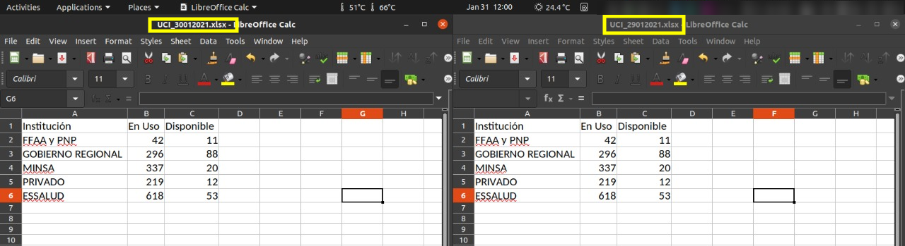
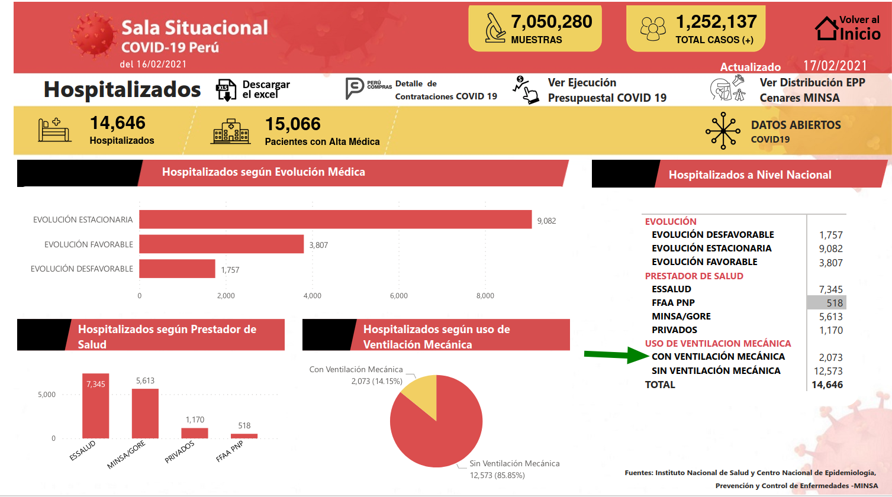
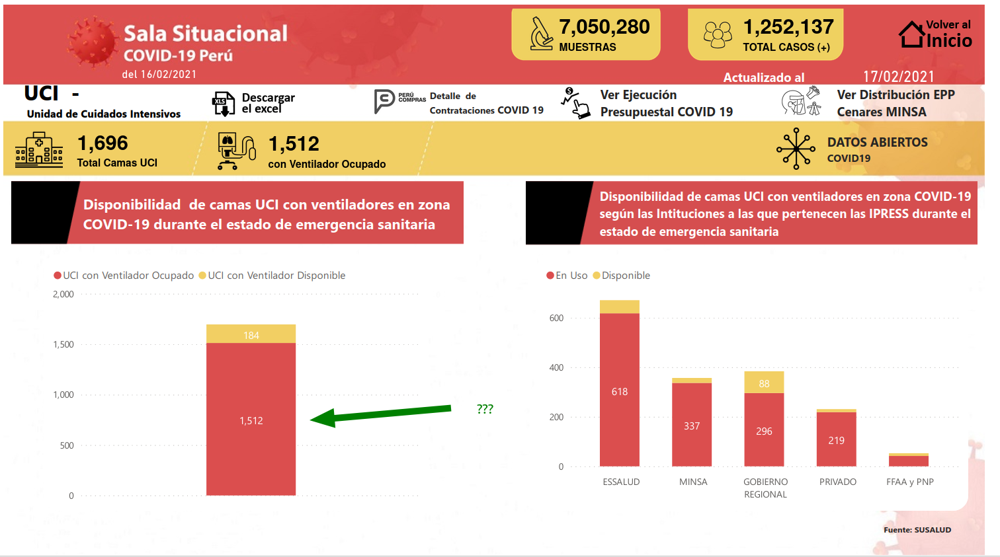
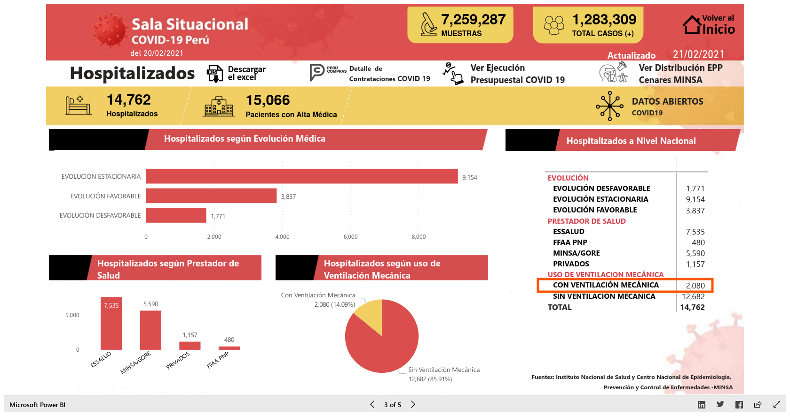
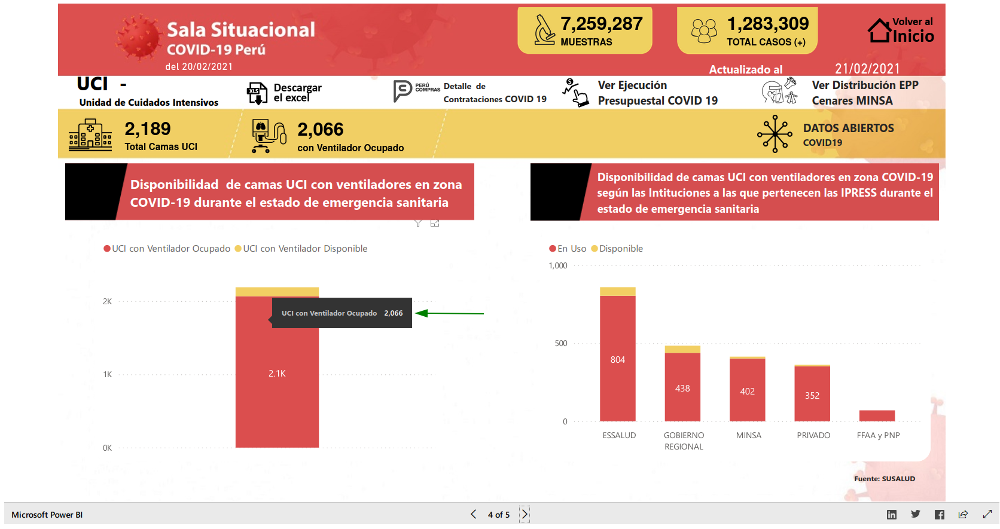
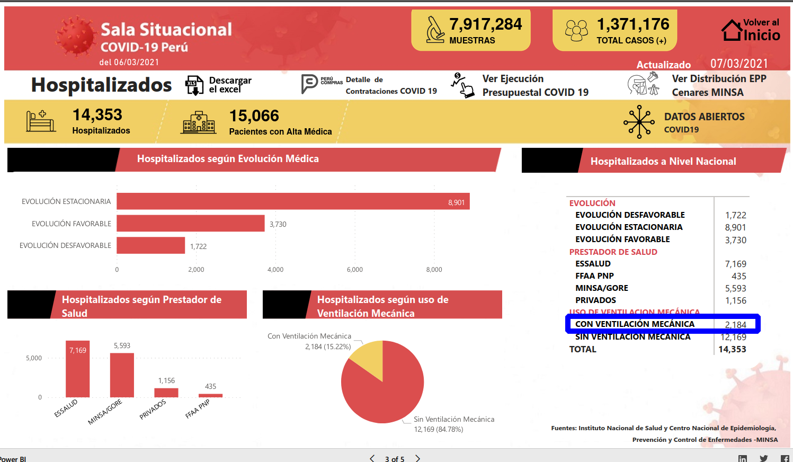
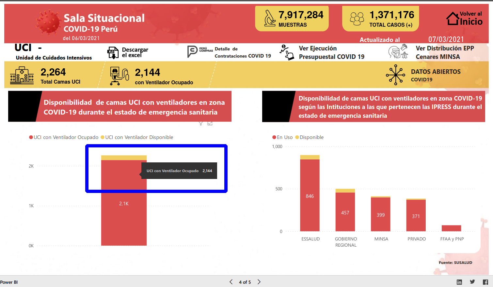
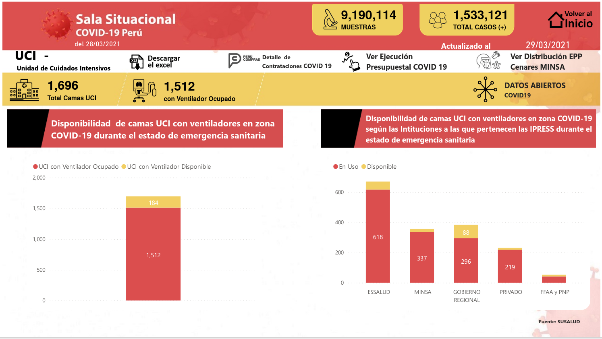

**Última actualización**: `r lubridate::now(tzone = "UTC")` UTC

[](https://zenodo.org/badge/latestdoi/247552256)

[](https://eu.badgr.com/public/assertions/nmrQrfZnQPmsV-ZcG8nrLA)

## Motivación

MINSA está publicando en su cuenta de Twitter y en la sección de "Noticias" del portal del gobierno peruano, comunicados con información sobre COVID-19, pero no hay un repositorio de datos abiertos que pueda ser usado por todos.

Seguiré actualizando diariamente mientras esta información se encuentre disponible.

Espero que pronto MINSA ponga un repositorio de datos abiertos con la información nececasaria, y cuando eso ocurra, este repositorio ya no se actualzará.

## Información importante sobre los datos publicados

**2020-03-03**: A partir de hoy, MINSA ha puesto una "Sala situacional" oficial en https://covid19.minsa.gob.pe/sala_situacional.asp. Los datos de este día fueron tomados de las "Sala Situacional" del MINSA, el cual no tiene información (al día de hoy) acerca del número de recuperados

**2020-04-08**: A partir de hoy, en la "Sala situacional" se comenzaron a publicar el número de casos confirmados por pruebas moleculares (PCR), y por "pruebas rápidas" (serológicas) por cada región. Esto se ha agregado a los datos.

**2020-04-12**: A partir de este día, la "Sala Situacional" ha dejado de publicar el número de fallecimientos por región, y ha agregado el número de casos positivos confirmados por ambos tipos de pruebas: moleculares (PCR) y serológica ("rapida").

**2020-04-13**: La "Sala Situacional" no fue actualizada en este día (revisado a las 21:53h), por lo que no hay datos disponibles de pruebas por región.

**2020-04-14**: La "Sala Situacional" está mostrando nuevamente los fallecimientos y los resultados de pruebas positivas por región.

**2020-04-15**: La "Sala Situacional" ya no publica los casos en que se confirmaron por ambos tipos de pruebas, para las regiones.

**2020-04-23**: Se ha ampliado la cuarentena hasta el 2020-05-10. Cálculo del tiempo de duplicación cambiado a cada 5 días.

**2020-04-27**: En la "Sala Situacional" se ha comenzado a publicar el número de camas UCI disponibles y en uso.

**2020-05-03**: MINSA no publicó hoy información acerca de las camas UCI.

**2020-05-04**: MINSA no actualizó su "Sala Situacional" hoy [Captura de pantalla del 2020-05-04](minsa-reportes/screenshot-covid19.minsa.gob.pe-2020.05.05-00_15_53.png), de manera que no se ha actualizado ni el número de fallecimientos por región, ni el número de positivos por tipo de prueba.

**2020-05-05**: MINSA nuevamente publicó su "Sala Situacional" actualizada, incluyendo información de camas UCI.

**2020-05-06**: Desde hoy se pueden descargar los datos (parciales) de la "Sala Situacional" del MINSA en formato XLSX

**2020-05-16**: He añadido los datos en formato JSON comprimido (.json.gz) convertidos a partir de los CSV (Issue #2)

**2020-05-18**: Desde hoy hay un API que han construído tomando este repositorio como una fuente: https://github.com/DataScienceResearchPeru/covid-19_latinoamerica

**2020-05-22**: El presidente anunció que el estado de emergencia se extenderá hasta el 2020-06-30

**2020-05-28**: Usando los datos de positivad por departamento publicados en la "Sala Situacional..." del MINSA, he podido recuperar el número de negativos por departamento, desde el 2020-05-06 hasta hoy.

**2020-05-29**: Hasta las 22:40h (PET), no se han publicado nuevos datos en la "Sala Situacional...". Datos con menos detalle para el día de hoy.

**2020-05-30**: Los datos de ayer y hoy están disponibles en la "Sala Situacional ...", la visualización es la correspondiente al día de hoy.

**2020-06-10**: Desde hoy ya no aparece en la "Sala Situacional ..." el archivo en formato XLSX con los datos de casos, se está reconstruyendo de la visualización en el dashboard, en formato ISO OpenDocument (.ods)

**2020-06-11**: El archivo de casos aún no está disponible, el intentar descargarlo produce un error **HTTP 404**

**2020-06-12**: Hasta las 18:30h (PET) no se ha actualizado la "Sala Situacional ..." del MINSA. La "Sala Situacional ..." aparace actualizada aparentemente a ~21:38h (según el timestamp de los archivos XLSX).

**2020-06-16**: La "Sala Situacional ..." no incluye hoy información sobre las camas UCI en uso o disponibles.

**2020-06-17**: Retornó la información sobre camas UCI en la "Sala Situacional ..."

**2020-07-05**: Hoy los datos del Departamento de Lima están separados en Lima Metropolitana y Lima Región, en la "Sala Situacional ..."

**2020-07-07**: A partir de hoy, en la información de la Sala Situacional, la positividad de los resultados sólo está considerando los que provienen de PCR, y ya no la suma de PCR + Pruebas serológicas. He agregado una columna con el total de pruebas reportadas por cada departamento.

**2020-07-18**: Hoy no han publicado archivos con datos en la Sala Situacional (hasta las 18:30h), por lo que los datos han sido extraídos de la visualización publicada.

**2020-07-20**: Hoy tampoco han publicado archivos con datos en la Sala Situacional (hasta las 20:00h), por lo que los datos han sido extraídos de la visualización publicada.

**2020-07-22**: En el comunicado 180 del MINSA se indica que se ha revisado el número de fallecimientos para incluir a 3,688 casos comprobados de COVID-19, pero esto no se refleja aún en los datos publicados.

**2020-07-25**: Hoy, hasta las 20:35h, no se han publicado datos ni actualizado la Sala Situacional, y el comunicado 183 no contiene información por departamento. MINSA indica que han tenido problemas técnicos (ref: https://twitter.com/Minsa_Peru/status/1287111345024925697)

**2020-07-26**: Hoy, hasta las 22:50h, no se han publicado datos ni actualizado las Sala Situacional, y el comunicado 186 no contiene información por departamento, ni los detalles de las pruebas que usualmente se publican. (ref: https://twitter.com/Minsa_Peru/status/1287587172892246016)

**2020-07-27**: Tampoco hoy se ha actualizado (hasta las 20:00h) la "Sala Situacional...", y el comunicado 187 ya no contiene la información por departamente, pero volvieron los detalle generales por tipo de prueba. (ref: https://www.gob.pe/institucion/minsa/noticias/216606-minsa-casos-confirmados-por-coronavirus-covid-19-ascienden-a-389-717-en-el-peru-comunicado-n-187 y https://twitter.com/Minsa_Peru/status/1287917699474042887)

**2020-07-28**: Sala Situacional ha sido actualizada con datos al 2020-07-27, nuevamente los datos están disponibles en https://covid19.minsa.gob.pe/sala_situacional.asp

**2020-07-30**: La "Sala Situacional..." no ha sido actualizada hasta las 23:30h de hoy. (Nota del 2020-07-31, 19:00h: aún se observan los datos del 2020-07-29)

**2020-08-01**: Hoy se observan publicados los datos del 2020-07-30 en la "Sala Situacional ...". El comunicado con información del 2020-07-31 fue publicado sin información por departamento. No hay datos en la "Sala Situacional..." del 2020-07-31.

**2020-08-02**: Los datos del 2020-08-01 fueron publicados hoy en la "Sala Situacional...". Hoy salió el comunicado 194, con información general, sin detalles por tipo de prueba ni por departamento.

**2020-08-03**: Hoy en la mañana salieron publicados en la "Sala Situacional..." los datos del 2020-08-02, y por la noche los datos de hoy (2020-08-03). Por tercer día consecutivo la información de camas UCI no ha variado (los datos son los mismos para el 2020-08-01, el 2020-08-02 y el 2020-08-03)

**2020-08-04**: Los datos de la "Sala Situacional ..." fueron publicados, pero el comunicado 196 tiene menos detalles que antes.

**2020-08-05**: Por quinto dia, ya no hay detalles sobre el número de pruebas por tipo (moleculares o serológica), dejaré de actualizar esa parte de la información por ahora.

**2020-08-06**: Los datos de UCI y de altas médicas se están repitiendo con frecuencia de un día al siguiente.

**2020-08-11**: Desde el 2020-08-01, los datos de UCI y de altas médicas no han cambiado, son exactamente los mismos.

**2020-08-17**: Los datos de UCI se están actualizando nuevamente, pero la cifre de altas médicas en la Sala Situacional permanece inalterada desde el 2020-08-02

**2020-09-03**: No se publicaron datos del 2020-09-02 en la Sala Situacional, que permanece hasta hoy (22:45PET) con datos del 2020-09-01

**2020-09-22**: No se publicaron datos del 2020-09-21 en la Sala Situacional. Hasta hoy (2020-09-22, 21:45PET) aparecen los datos del 20 de setiembre del 2020.

**2020-10-04**: Hasta las 23:50h de hoy no se han publicado los datoe del 2020-10-03 en la Sala Situacional, pero si los del 2020-10-04

**2020-11-02**: Hasta las 20:00h de hoy, no han publicado en la Sala Situacional, los datos del 2020-11-01

**2020-11-03**: Hasta las 23:10h de hoy, no han publicado en la Sala Situacional, los datos del 2020-11-02

**2020-11-04**: Datos de casos, fallecimientos confirmados y pruebas por departamento para 2020-11-01,02,03 han sido obtenidos de otra fuente, pues la Sala Situacional del MINSA no ha sido actualizada en varios dias. Debido a esto, los datos de "Lima Región" contienen el total del departamento de Lima, y no se han desdoblado los valores para Lima Metropolitana.
- Datos del 2020-11-01: del documento https://www.dge.gob.pe/portal/docs/tools/coronavirus/coronavirus311020.pdf
- Datos del 2020-11-02: del documento https://www.dge.gob.pe/portal/docs/tools/coronavirus/coronavirus0111120.pdf
- Datos del 2020-11-03: del documento https://www.dge.gob.pe/portal/docs/tools/coronavirus/coronavirus0211120.pdf

**2020-11-04**: A aproximadamente 18:50h, se actualizó la Sala Situacional con datos de hoy

**2020-11-14**: Los datos de uso de UCI del 2020-11-13 son los mismos que los del dia 2020-11-12

**2020-11-15**: Hasta las 12:10h de hoy, no se ha publicado el Comunicado usual por parte del MINSA. El último ha sido el [N°305](https://www.gob.pe/institucion/minsa/noticias/314348-minsa-casos-confirmados-por-coronavirus-covid-19-ascienden-a-932-650-en-el-peru-comunicado-n-305)acerca de los datos del 2020-11-13. 
- El comunicado 306, apareció mas tarde publicado en: https://www.gob.pe/institucion/minsa/noticias/314403-minsa-casos-confirmados-por-coronavirus-covid-19-ascienden-a-934-899-en-el-peru-comunicado-n-306

**2020-11-19**: No se publicaron en la Sala Situacional los datos para el 2020-11-18, por lo que datos parciales se obtuvieron del reporte https://www.dge.gob.pe/portal/docs/tools/coronavirus/coronavirus171120.pdf.

**2020-11-26**: No se publicaron los datos en la Sala Situacional, correspondientes al 2020-11-25, los datos parciales se han obtenido del reporte: https://www.dge.gob.pe/portal/docs/tools/coronavirus/coronavirus241120.pdf.

**2020-12-02**: No se publicaron los datos del 2020-12-01 en la Sala Situacional, y se han obtenido datos parciales del reporte: https://www.dge.gob.pe/portal/docs/tools/coronavirus/coronavirus301120.pdf

**2020-12-04**: No se publicaron los datos del 2020-12-03 en la Sala Situacional, los datos parciales se han obtenido de https://www.dge.gob.pe/portal/docs/tools/coronavirus/coronavirus021220.pdf

**2020-12-08**: Hasta las 20:55h de hoy, no se han publicado los datos del 2020-12-07 en la Sala Situacional, por lo que se han obtenido datos parciales de https://www.dge.gob.pe/portal/docs/tools/coronavirus/coronavirus061220.pdf

**2020-12-10**: Hasta las 15:00h de hoy, no se han publicado los datos del 2020-12-09 en la Sala Situacional, y se han obtenido datos parciales de https://www.dge.gob.pe/portal/docs/tools/coronavirus/coronavirus081220.pdf

**2020-12-13**: Hasta las 23:00h de hoy, no se han publicado los datos del 2020-12-12 en la Sala Situacional, de manera que he obtenido datos parciales de https://www.dge.gob.pe/portal/docs/tools/coronavirus/coronavirus111220.pdf

**2020-12-16**: Hasta las 21:00h de hoy, no se han publicado los datos del 2020-12-15 en la Sala Situacional, se han extraido datos parciales usando https://www.dge.gob.pe/portal/docs/tools/coronavirus/coronavirus141220.pdf

**2020-12-18**: Hasta las 21:20h de hoy, no se han publicado los datos del 2020-12-17 en la Sala Situacional, se han extraido datos parciales usando https://www.dge.gob.pe/portal/docs/tools/coronavirus/coronavirus161220.pdf

**2020-12-19**: Hasta las 20:30h de hoy, no se han publicado los datos del 2020-12-18 en la Sala Situacional, se han extraido datos parciales usando https://www.dge.gob.pe/portal/docs/tools/coronavirus/coronavirus171220.pdf

**2020-12-24**: Hasta las 18:00h de hoy, no se han publicado los datos del 2020-12-23 en la Sala Situacional, se han extraido datos parciales usando https://www.dge.gob.pe/portal/docs/tools/coronavirus/coronavirus221220.pdf

**2020-12-27**: Hasta las 18:45h de hoy, no se han publicado los datos del 2020-12-26 en la Sala Situacional, se han extraido datos parciales usando https://www.dge.gob.pe/portal/docs/tools/coronavirus/coronavirus251220.pdf

**2020-12-31**: Hasta las 21:00 de hoy, no se han publicado los datos del 2020-12-30 en la Sala Situacional, se han extraido datos parciales usando https://www.dge.gob.pe/portal/docs/tools/coronavirus/coronavirus291220.pdf

**2021-01-02**: Hasta las 20:30 de hoy, no se han publicado los datos del 2021-01-01 en la Sala Situacional, se han extraido datos parciales usando https://www.dge.gob.pe/portal/docs/tools/coronavirus/coronavirus311220.pdf

**2021-01-03**: Por algún motivo, el comunicado del MINSA publicado el 2021-01-01 y el publicado el 2021-01-02, tienen el mismo número (N° 375). *Nota de las 23:00h*: el número del comunicado fue corregido a 376, pero el URL se mantiene el mismo.

**2021-01-05**: Hasta las 20:00 de hoy, no se han publicado los datos del 2021-01-04 en la Sala Situacional, se han extraido datos parciales usando https://www.dge.gob.pe/portal/docs/tools/coronavirus/coronavirus030121.pdf

**2021-01-07**: Hasta las 20:40 de hoy, no se han publicado los datos del 2021-01-06 en la Sala Situacional, se han extraido datos parciales usando https://www.dge.gob.pe/portal/docs/tools/coronavirus/coronavirus050121.pdf. Usando la información de DGE/MINSA, se está incluyendo una columna que contiene el número de pruebas antigénicas positivas (`ag_test_positive`)

**2021-01-09**: Hasta las 22:00 de hoy, no se han publicado los datos del 2021-01-08 en la Sala Situacional, se han extraido datos parciales usando https://www.dge.gob.pe/portal/docs/tools/coronavirus/coronavirus070121.pdf

**2021-01-10**: Hasta las 23:00 de hoy, no se han publicado los datos del 2021-01-09 en la Sala Situacional, se han extraido datos parciales usando https://www.dge.gob.pe/portal/docs/tools/coronavirus/coronavirus080121.pdf

**2021-01-14**: Hasta las 22:45 de hoy, no se han publicado los datos del 2021-01-13 en la Sala Situacional, se han extraido datos parciales usando https://www.dge.gob.pe/portal/docs/tools/coronavirus/coronavirus120121.pdf

**2021-01-18**: Hasta las 20:00 de hoy, no se han publicado los datos del 2021-01-17 en la Sala Situacional, se han extraido datos parciales usando https://www.dge.gob.pe/portal/docs/tools/coronavirus/coronavirus160121.pdf

**2021-01-19**: Hasta las 20:30 de hoy, no se han publicado los datos del 2021-01-18 en la Sala Situacional, se han extraido datos parciales usando https://www.dge.gob.pe/portal/docs/tools/coronavirus/coronavirus170121.pdf

**2021-01-21**: Hasta las 18:30 de hoy, no se han publicado los datos del 2021-01-20 en la Sala Situacional, se han extraido datos parciales usando https://www.dge.gob.pe/portal/docs/tools/coronavirus/coronavirus190121.pdf

**2021-01-23**: Hasta las 23:20 de hoy, no se han publicado los datos del 2021-01-22 en la Sala Situacional, se han extraido datos parciales usando https://www.dge.gob.pe/portal/docs/tools/coronavirus/coronavirus21012021.pdf

**2021-01-24**: Hasta las 20:40 de hoy, no se han publicado los datos del 2021-01-23 en la Sala Situacional, se han extraido datos parciales usando https://www.dge.gob.pe/portal/docs/tools/coronavirus/coronavirus220121.pdf

**2021-01-25**: Los datos de la Sala Situacional publicados para el 2021-01-24, parecent tener información del 2021-01-23 al menos en las secciones de UCI y Hospitalización. Se están usando los XLSX publicados por ser los datos oficiales, pero no coincides con las cifras del comunicado 399 del MINSA.

**2021-01-27**: Hasta las 20:45 de hoy, no se han publicado los datos del 2021-01-26 en la Sala Situacional, se han extraido datos parciales usando https://www.dge.gob.pe/portal/docs/tools/coronavirus/coronavirus250121.pdf

**2021-01-29**: Hasta las 18:00 de hoy, no se han publicado los datos del 2021-01-28 en la Sala Situacional, se han extraido datos parciales usando https://www.dge.gob.pe/portal/docs/tools/coronavirus/coronavirus270121.pdf

**2021-01-30**: Los datos de UCI publicados en la Sala Situacional, que estoy usando para tener un conteo del uso de UCIs, en las últimas semanas no es muy confiable, pues discrepa en totales de los valores que se publican tanto en la sección "Hospitalizados" de la Sala Situacional, como en el comunicado oficial del MINSA. Sugiero cuidado al interpretar esos valores de UCI pues la fuente parece estar defectuosa. También, desde el 2020-08-03 el valor de altas médicas no ha cambiado, por lo que voy a dejar de registrar dicho valor pues es imposible que se quedara en 15,066 altas médicas sin cambio alguno.

**2021-01-31**: Los datos de UCI publicados en la Sala Situacional siguen incorrectos, en este caso, no sólo no coinciden con los publicados en el comunicado oficial del 2021-01-30, sino que son los mismos datos que el 2021-01-29 (que también estaban incorrectos)



**2021-02-03**: Inconsistencias en los datos de UCI publicados en la Sala Situacional, en la visualización UCI se indican *1,943* personas, pero tanto en la tabla de hospitalizaciones como en el comunicado 412 del MINSA, se indica que el número es **1,956**.

**2021-02-04**: Nuevamente hay inconsistencias en los datos de UCI publicados en la Sala Situacional, en la visualización UCI se indican *1,512* personas, pero tanto en la tabla de hospitalizaciones como en el comunicado 413 del MINSA, se indica que el número es **1,961**.

**2021-02-05**: Hasta las 15:45 de hoy, no se han publicado los datos del 2021-02-04 en la Sala Situacional, se han extraido datos parciales usando https://www.dge.gob.pe/portal/docs/tools/coronavirus/coronavirus030221.pdf

**2021-02-09**: Hasta las 09:30 de hoy, no se ha publicado comunicado para el 2021-02-08, pero si datos en la Sala Situacional y reportes del DGE/MINSA

**2021-02-05**: Hasta las 18:30 de hoy, no se han publicado los datos del 2021-02-10 en la Sala Situacional, se han extraido datos parciales usando https://www.dge.gob.pe/portal/docs/tools/coronavirus/coronavirus090221.pdf

**2021-02-15**: Los datos publicados en la Sala Situacional para el 2021-02-10 para el número de camas UCI en uso (2,052), no coinciden con lo publicado en el comunicado 425 (que indica 2,083)

**2021-02-18**: Inconsistencia en los datos de camas UCI publicados en la Sala Situacional. 

En la sección de "Hospitalizados" se muestra un valor consistente con el Comunicado 428: 2,073 camas



Mientras que en la sección de "UCI", se muestra una cifra de 1,512




**2021-02-19**: Hasta las 17:45 de hoy, no se han publicado los datos del 2021-02-18 en la Sala Situacional, se han extraido datos parciales usando https://www.dge.gob.pe/portal/docs/tools/coronavirus/coronavirus170221.pdf

**2021-02-22**: Inconsistencias, nuevamente, en el número de camas UCI en la Sala Situacional:

La sección de "Hospitalizados" muestra 2,080 camas UCI con ventilación mecánica en uso, que es el número publicado en el comunicado N° 432 del MINSA



Pero, en la sección de "UCI" de la misma visualización, el valor es de 2,066.



**2021-02-24**: Los XLSX publicados en la Sala Situacional no coinciden con los datos de las visualizaciones, y no se ha publicado comunicado del MINSA aún

**2021-02-28**: Hasta las 18:30h de hoy no se han publicado datos del 2021-02-27 en la Sala Situacional.

**2021-03-04**: Se ha detectado una inconsistencia en los datos de los comunicados N° 441 y 442 (https://www.gob.pe/institucion/minsa/noticias/344816-minsa-casos-confirmados-por-coronavirus-covid-19-ascienden-a-1-344-969-en-el-peru-comunicado-n-441 y https://www.gob.pe/institucion/minsa/noticias/345003-minsa-casos-confirmados-por-coronavirus-covid-19-ascienden-a-1-349-847-en-el-peru-comunicado-n-442)

En el Comunicado N° 441 del MINSA dice:

> **5. Del total de casos confirmados, a la fecha, 1 250 047 personas cumplieron su período de aislamiento domiciliario o fueron dados de alta de un establecimiento de salud.**

[Ver captura parcial del Comunicado N° 441](minsa-reportes/imgs/screenshot-www.gob.pe-reporte-441.png)

Mientras que en el Comunicado N° 442, se tiene lo siguiente:

> **5. Del total de casos confirmados, a la fecha, 1 248 642 personas cumplieron su período de aislamiento domiciliario o fueron dados de alta de un establecimiento de salud.**

[Ver captura parcial del Comunicado N° 442](minsa-reportes/imgs/screenshot-www.gob.pe-reporte-442.png)

**2021-03-05**: Hasta las 17:30 de hoy, no se han publicado datos del 2021-03-04 en la Sala Situacional, por lo que se han extraido datos parciales usando https://www.dge.gob.pe/portal/docs/tools/coronavirus/coronavirus030321.pdf

**2021-03-07**: Hasta las 16:30 de hoy, no se han publicado datos del 2021-03-06 en la Sala Situacional, por lo que se han extraido datos parciales usando https://www.dge.gob.pe/portal/docs/tools/coronavirus/coronavirus050321.pdf

**2021-03-08**: Inconsistencias, en el número de camas UCI en la Sala Situacional:

La sección de "Hospitalizados" muestra 2,184 camas UCI con ventilación mecánica en uso, que es el número publicado en el comunicado N° 446 del MINSA



Pero, en la sección de "UCI" de la misma visualización, el valor es de 2,144, como se ve en la captura de pantalla siguiente



**2021-03-09**: Hasta las 15:00 de hoy, no se han publicado datos del 2021-03-08 en la Sala Situacional, por lo que se han extraido datos parciales usando https://www.dge.gob.pe/portal/docs/tools/coronavirus/coronavirus070321.pdf

**2021-03-15**: Hasta las 19:30 de hoy, no se han publicado datos del 2021-03-14 en la Sala Situacional, por lo que se han extraido datos parciales usando https://www.dge.gob.pe/portal/docs/tools/coronavirus/coronavirus130321.pdf

**2021-03-16**: Hasta las 16:15 de hoy, no se han publicado datos del 2021-03-15 en la Sala Situacional, por lo que se han extraido datos parciales usando https://www.dge.gob.pe/portal/docs/tools/coronavirus/coronavirus140321.pdf

**2021-03-18**: Valores inconsistentes en la Sala Situacional para camas UCI, en la sección de "Hospitalización", se indican 2,251 en uso, pero en la sección de "UCI" se indican 2,227 camas en uso.

**2021-03-19**: Hasta las 18:30 de hoy, no se han publicado datos del 2021-03-18 en la Sala Situacional, por lo que se han extraido datos parciales usando https://www.dge.gob.pe/portal/docs/tools/coronavirus/coronavirus170321.pdf

**2021-03-20**: Hasta las 16:30 de hoy, no se han publicado datos del 2021-03-19 en la Sala Situacional, por lo que se han extraido datos parciales usando https://www.dge.gob.pe/portal/docs/tools/coronavirus/coronavirus180321.pdf

**2021-03-20**: Hasta las 18:15 de hoy, no se han publicado datos del 2021-03-22 en la Sala Situacional, por lo que se han extraido datos parciales usando https://www.dge.gob.pe/portal/docs/tools/coronavirus/coronavirus210321.pdf

**2021-03-26**: Hay inconsistencia en el número de camas UCI publicadas en la Sala Situacional al 2021-03-25, en la sección de "Hospitalización" se indican 2,276 camas, mientras que en la sección UCI se indican 2,249

**2021-03-27**: Hasta las 17:15 de hoy, no se han publicado datos del 2021-03-26 en la Sala Situacional, por lo que se han extraido datos parciales usando https://www.dge.gob.pe/portal/docs/tools/coronavirus/coronavirus250321.pdf

**2021-03-28**: Los datos publicados en la Sala Situacional para el 2021-03-28 para el número de camas UCI en uso (2,227), no coinciden con lo publicado en el comunicado 466 (que indica 2,301)

**2021-03-29**: Hasta las 12:40 de hoy, no se han publicado datos del 2021-03-28 en la Sala Situacional, por lo que se han extraido datos parciales usando https://www.dge.gob.pe/portal/docs/tools/coronavirus/coronavirus270321.pdf

**2021-03-30**: Inconsistencias, en el número de camas UCI en la Sala Situacional para el 2021-03-29:

La sección de "Hospitalizados" muestra 2,278 camas UCI con ventilación mecánica en uso, que es el número publicado en el comunicado N° 470 del MINSA



Pero, en la sección de "UCI" de la misma visualización, el valor es de 1,512, como se ve en la captura de pantalla siguiente


**2021-03-31**: Inconsistencia en el número de camas UCI en la Sala Situacional para el 2021-03-30, en la sección de Hospitalización se indica 2,290 camas UCI con respirador, pero en la sección de "UCI", se indica 2,288.

**2021-04-02**: Inconsistencia en el número de camas UCI en la Sala Situacional para el 2021-04-01, en la sección de Hospitalización se indica 2,065 camas UCI con respirador, pero en la sección de "UCI", se indica 2,327.

**2021-04-03**: Inconsistencia en el número de camas UCI en la Sala Situacional para el 2021-04-02, en la sección de Hospitalización se indica 2,357 camas UCI con respirador, pero en la sección de "UCI", se indica 2,327 (igual que para el 2021-04-01)

**2021-04-04**: Inconsistencia en el número de camas UCI en la Sala Situacional para el 2021-04-03, en la sección de Hospitalización se indica 2,373 camas UCI con respirador, pero en la sección de "UCI", se indica 2,375.

**2021-04-05**: Inconsistencia en el número de camas UCI en la Sala Situacional para el 2021-04-04, en la sección de Hospitalización se indica 2,307 camas UCI con respirador, pero en la sección de "UCI", se indica 2,373.

**2021-04-06**: Inconsistencia en el número de camas UCI en la Sala Situacional para el 2021-04-05, en la sección de Hospitalización se indica 2,348 camas UCI con respirador, pero en la sección de "UCI", se indica 2,380.

**2021-04-07**: Inconsistencia en el número de camas UCI en la Sala Situacional para el 2021-04-06, en la sección de Hospitalización se indica 2,452 camas UCI con respirador, pero en la sección de "UCI", se indica 2,454.

**2021-04-08**: Hasta las 22:00 de hoy, no se han publicado datos del 2021-04-07 en la Sala Situacional, por lo que se han extraido datos parciales usando https://www.dge.gob.pe/portal/docs/tools/coronavirus/coronavirus060421.pdf. Además, existe inconsistencia en el número de camas UCI en la Sala Situacional para el 2021-04-08, en la sección de Hospitalización se indica 2,246 camas UCI con respirador, pero en la sección de "UCI", se indica 2,520.

**2021-04-09**: Inconsistencia en el número de camas UCI en la Sala Situacional para el 2021-04-09, en la sección de Hospitalización se indica 2,313 camas UCI con respirador, pero en la sección de "UCI", se indica 2,605.

**2021-04-10**: Inconsistencia en el número de camas UCI en la Sala Situacional para el 2021-04-10, en la sección de Hospitalización se indica 2,321 camas UCI con respirador, pero en la sección de "UCI", se indica 2,666.

**2021-04-12**: Inconsistencia en el número de camas UCI en la Sala Situacional para el 2021-04-11, en la sección de Hospitalización se indica 2,302 camas UCI con respirador, pero en la sección de "UCI", se indica 2,666 (la misma cantidad que el 2021-04-10).

**2021-04-13**: Inconsistencia en el número de camas UCI en la Sala Situacional para el 2021-04-12, en la sección de Hospitalización se indica 2,073 camas UCI con respirador, pero en la sección de "UCI", se indica 2,592.

**2021-04-14**: Inconsistencia en el número de camas UCI entre el comunicado N° 489 (que indica 2,599 camas), la Sala Situacional para el 2021-04-13, que muestra en la sección de Hospitalización: 2,406 camas UCI con respirador, y en la sección de "UCI", se indica 2,601.

**2021-04-15**: Inconsistencia en el número de camas UCI entre el comunicado N° 490 (que indica 2,615 camas) y la Sala Situacional para el 2021-04-14, que muestra en la sección de Hospitalización: 2,405 camas UCI con respirador (la sección de "UCI", muestra, consistentemente, 2,615 camas).

**2021-04-16**: Inconsistencia en el número de camas UCI entre el comunicado N° 492 (que indica 2,603 camas), la Sala Situacional para el 2021-04-15, que muestra en la sección de Hospitalización: 2,409 camas UCI con respirador, y en la sección de "UCI", se indica 2,604.

**2021-04-17**: Inconsistencia en el número de camas UCI entre el comunicado N° 493 (que indica 2,591 camas) y la Sala Situacional para el 2021-04-16, que muestra en la sección de Hospitalización: 2,414 camas UCI con respirador.

**2021-04-18**: Inconsistencia en el número de camas UCI entre el comunicado N° 495 (que indica 2,616 camas) y la Sala Situacional para el 2021-04-17, que muestra en la sección de Hospitalización: 2,439 camas UCI con respirador, asi como 2,629 camas en la sección de UCI.

**2021-04-19**: Inconsistencia en el número de camas UCI entre el comunicado N° 496 (que indica 2,636 camas) y la Sala Situacional para el 2021-04-18, que muestra en la sección de Hospitalización: 2,432 camas UCI con respirador.

**2021-04-20**: Inconsistencia en el número de camas UCI entre el comunicado N° 497 (que indica 2,574 camas) y la Sala Situacional para el 2021-04-19, que muestra en la sección de Hospitalización: 2,421 camas UCI con respirador, asi como 2,573 camas en la sección de UCI.

**2021-04-21**: Inconsistencia en el número de camas UCI entre el comunicado N° 498 (que indica 2,580 camas) y la Sala Situacional para el 2021-04-20, que muestra en la sección de Hospitalización: 2,453 camas UCI con respirador.

**2021-04-22**: Hasta las 17:35 de hoy, no se han publicado datos del 2021-04-21 en la Sala Situacional, por lo que se han extraido datos parciales usando https://www.dge.gob.pe/portal/docs/tools/coronavirus/coronavirus200421.pdf

**2021-04-22**: Inconsistencia en el número de camas UCI entre el comunicado N° 500 (que indica 2,614 camas) y la Sala Situacional para el 2021-04-22, que muestra en la sección de Hospitalización: 2,489 camas UCI con respirador, asi como 2,622 camas en la sección de UCI.

**2021-04-24**: Hasta las 12:30 de hoy, no se han publicado datos del 2021-04-23 en la Sala Situacional, por lo que se han extraido datos parciales usando https://www.dge.gob.pe/portal/docs/tools/coronavirus/coronavirus220421.pdf. Se actualizó la Sala Situacional en la tarde, con inconsistencia entre los datos de camas UCI del comunicado N° 501 (2,642 camas UCI), y la secciones UCI (2,641 camas) y de Hospitalización (2,515 camas) de la Sala Situacional.

**2021-04-24**: Inconsistencia en el número de camas UCI entre el comunicado N° 503 (que indica 2,646 camas) y la Sala Situacional para el 2021-04-24, que muestra en la sección de Hospitalización: 2,534 camas UCI con respirador. También no hay concordancia entre el número de hospitalizados, que es de 15,258 en el comunicado, y 15,248 en la Sala Situacional.

**2021-04-26**: Inconsistencia en el número de camas UCI entre el comunicado N° 504 (que indica 2,618 camas) y la Sala Situacional para el 2021-04-25, que muestra en la sección de Hospitalización: 2,497 camas UCI con respirador.

**2021-04-27**: Inconsistencia en el número de camas UCI entre el comunicado N° 505 (que indica 2,628 camas) y la Sala Situacional para el 2021-04-26, que muestra en la sección de Hospitalización: 2,512 camas UCI con respirador. 

**2021-04-28**: Inconsistencia en el número de camas UCI entre el comunicado N° 506 (que indica 2,642 camas) y la Sala Situacional para el 2021-04-27, que muestra en la sección de Hospitalización: 2,531 camas UCI con respirador, y en la sección UCI: 2,641 camas.

**2021-04-29**: Hasta las 17:30h de hoy no se han publicado en la Sala Situacional los datos del 2021-04-28.

**2021-04-30**: Inconsistencia en el número de camas UCI entre el comunicado N° 508 (que indica 2,679 camas) y la Sala Situacional para el 2021-04-29, que muestra en la sección de Hospitalización: 2,567 camas UCI con respirador. 

**2021-04-30**: Inconsistencia en el número de camas UCI entre el comunicado N° 509 (que indica 2,652 camas) y la Sala Situacional para el 2021-04-30, que muestra en la sección de Hospitalización: 2,550 camas UCI con respirador. 

**2021-05-02**: Inconsistencia en el número de camas UCI entre el comunicado N° 510 (que indica 2,667 camas) y la Sala Situacional para el 2021-05-01, que muestra en la sección de Hospitalización: 2,567 camas UCI con respirador. 

**2021-05-03**: Inconsistencia en el número de camas UCI entre el comunicado N° 512 (que indica 2,654 camas) y la Sala Situacional para el 2021-05-02, que muestra en la sección de Hospitalización: 2,558 camas UCI con respirador y la sección de UCI: 2,680 camas. 

**2021-05-04**: Nunca se publicó ni reporte de DGE/MINSA ni Sala Situacional para el 2021-05-03.

**2021-05-04**: Inconsistencia en el número de camas UCI entre el comunicado N° 515 (que indica 2,657 camas) y la Sala Situacional para el 2021-05-04, que muestra en la sección de Hospitalización: 2,566 camas UCI con respirador, y en la sección UCI: 2,701 camas. No se ha publicado aún el reporte de DGE/MINSA.

**2021-05-04**: Aproximadamente a las 21:15h de hoy se publicaron los reportes de DGE/MINSA coronavirus020521.pdf (datos del 2021-05-03), y coronavirus030521.pdf (datos del 2021-05-04)

**2021-05-06**: Inconsistencia en el número de camas UCI entre el comunicado N° 516 (que indica 2,660 camas) y la Sala Situacional para el 2021-05-05, que muestra en la sección de Hospitalización: 2,545 camas UCI con respirador, y en la sección UCI: 2,661 camas.

**2021-05-07**: No se publicó ni reporte de DGE/MINSA ni Sala Situacional para el 2021-05-06.

**2021-05-08**: Hasta las 15:20h de hoy, se han publicado los reportes de DGE/MINSA para el 2021-05-06 y 2021-05-07, asi como la Sala Situacional de ayer. Hay inconsistencia en el número de camas UCI, el comunicado N° 518 indica 2,666, mientras que en la Sala Situacinal, en la sección de Hospitalización se tiene 2,560 y en la de UCI 2,667.

**2021-05-09**: Inconsistencia en el número de camas UCI entre el comunicado N° 520 (que indica 2,669 camas) y la Sala Situacional para el 2021-05-08, que muestra en la sección de Hospitalización: 2,582.

**2021-05-09**: Como las inconsistencias en el número de camas UCI entre los comunicados y la Sala Situacional, son muy prevalentes. Se van a usar en los datos recolectados, las cifras consignadas en los comunicados de ahora en adelante, y no se van a registrar diferencias aqui.

**2021-05-30**: Hasta las 20:00h del 2021-05-30, no se han publicado datos del 2021-05-29 ni en la Sala Situacional, ni mediante reporte de DGE/MINSA

**2021-06-01**: Hasta las 18:20h de hoy, no se ha publicado nada sobre el 2021-05-30, ni comunicado del MINSA, ni Sala Situacional, ni reporte de DGE/MINSA.

**2021-06-02**: El reporte de DGE correspondiente a los datos publicitados el 2021-06-01, ya está usando el nuevo criterio definido en [Criterios técnicos para actualizar la cifra de fallecidos por COVID-19 en el Perú](https://www.gob.pe/institucion/pcm/informes-publicaciones/1943691-criterios-tecnicos-para-actualizar-la-cifra-de-fallecidos-por-covid-19-en-el-peru), por tanto el número de fallecimientos ha subido de 69,342 (al 2021-05-30) a 184,507 (al 2021-06-01)

**2021-07-02**: Hasta el día de hoy, no hay datos de ninguna fuente (comunicado de MINSA, twitter de MINSA o reporte de DGE/MINSA) para el 2021-06-30. (Nota de las 15:45h, acaban de publicar el reporte de DGE correspondiente)

**2021-09-11**: El reporte del DGE correspondiente al 2021-09-10 (https://www.dge.gob.pe/portal/docs/tools/coronavirus/coronavirus090921.pdf), tiene datos incluídos en formato de imágen, por lo que se ha necesitado transcribirlos. Además se ha detectado errores en los totales mostrados en al menos una tabla (pruebas positivas totales).

## Fuentes

- [Cuenta de twitter del MINSA](https://twitter.com/Minsa_Peru)
- [Noticias del MINSA](https://www.gob.pe/busquedas?contenido[]=noticias&institucion[]=minsa&reason=sheet&sheet=1)
  - [RSS de Noticias del MINSA](https://www.gob.pe/busquedas.rss?contenido[]=noticias&institucion[]=minsa)
- [Reportes del Centro Nacional de Epidemiología, Prevención y control de enfermedades](https://www.dge.gob.pe/portalnuevo/covid-19/covid-cajas/situacion-del-covid-19-en-el-peru/)


## Notas

- Códigos de UBIGEO de https://github.com/CONCYTEC/ubigeo-peru
- Códigos ISO-3166-2, usando el paquete en R `ISOcodes`: https://cran.r-project.org/package=ISOcodes
- A partir del 2020-07-21, estoy usando los datos de población al 2019, así como latitud y longitud de las capitales de departamento reportados por CEPLAN en: https://www.ceplan.gob.pe/informacion-sobre-zonas-y-departamentos-del-peru/
	- Anteriormente se emplearon los datos de población por departamento (al 2017): https://www.inei.gob.pe/estadisticas/indice-tematico/poblacion-y-vivienda/
- El [reporte N°29 del MINSA](https://www.gob.pe/institucion/minsa/noticias/109838-minsa-casos-confirmados-por-coronavirus-covid-19-son-395-en-peru-comunicado-n-29) corrige el número de casos confirmados en Huánuco del [reporte N° 28](https://www.gob.pe/institucion/minsa/noticias/109810-minsa-casos-confirmados-por-coronavirus-covid-19-son-363-en-peru-comunicado-n-28)
- El dataset de JHU (https://github.com/CSSEGISandData/COVID-19), indica que Perú tiene 14 recuperados el día 2020-03-26
- En el dashboard se han agregado gráficos de la trayectoria total de casos, gráficos del número de recuperados y fallecidos, y un mapa con la densidad (casos por millón de personas) por región.
- El 2021-01-21, se reemplazaron los estimados poblaciones para usar los valores al 2020 (antes 2019). Fuente: https://www.minsa.gob.pe/reunis/data/poblacion_estimada.asp

## Visualizaciones

- [Dashboard interactivo sobre COVID-19 en el Perú](https://castagnetto.site/peru/dashboard-peru-covid-19.html)

## Formato de datos

- Los datos se están guardando en formatos abiertos exclusivamente, para asegurar la mayor compatibilidad posible: CSV y OpenDocument (ISO/IEC 26300-1:2015, ISO/IEC 26300-2:2015, ISO/IEC 26300-3:2015)

## Estructura de los archivos CSV

```{r child="datos/README.md"}
```

## Información empleada para recolectar los datos

```{r child="minsa-reportes/notas-de-prensa.md"}
```
